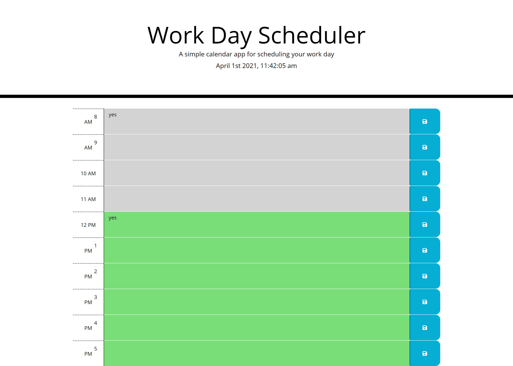

# Work-Day-Scheduler

## Links

<https://github.com/MichaelPappas2662/Work-Day-Scheduler> "GitHub Repo",

<https://michaelpappas2662.github.io/Work-Day-Scheduler/> "GitHub Pages"

## Application Description

This is a basic day planner app that loops through the hours of 8am - 5pm(typical working hours) for a specific date, which is the current day that the user opens the app. The app uses moment.js to handle time. The app also allows the user to enter and save text into any description field that has a class of future. The data will be saved to the localStorage of the browser. The past hours are highlighted gray, the current hour red, and future hours green.

## Narrative to try to accomplish

1. Create an simple app that uses bootstrap, jquery, moment.js, fontawesome, & google fonts
2. App is a simple day scheduler of typical working hours in a day.
3. Follows specific current date of when the user opens the app and use those hours of that day.
4. Allow the user to save text for each hour and change row color depending if it is a past, present for future hour.
5. Data of text is to be stored in localStorage of the browser until page is restarted. Refreshed page should still keep the localStorage.

## Screenshot

